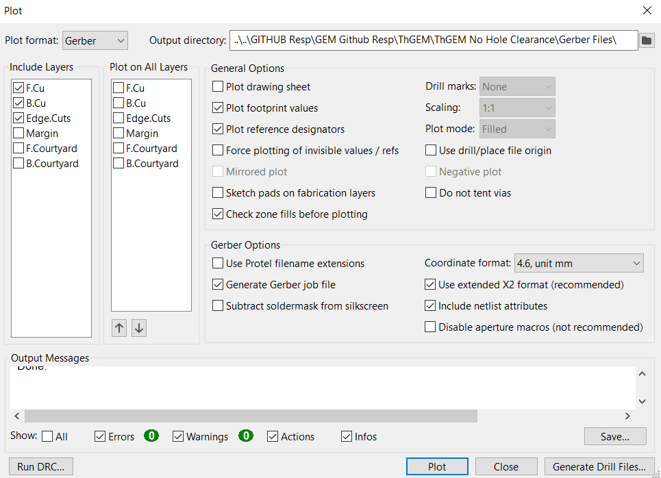

# ThGEM
Two iterations of ThGEM that are prototyped  
They were created with a custom component consistant of 2 parts.  
    

### Dimensions of the Board 
-Outer Ring (80 mm in Diamater)  
-Copper Circle (60 mm in Diamater)  
  
  
### Distance between GEM-Holes
**Pitch**: 0.8 mm (Distance Between the Center of Holes)  
  
  
### GEM-Hole Dimensions  
-Edge Cut (0.4 mm in Diameter)  
-No Fill Zone (0.42 mm in Diameter) #Only included in the Clearance Version  
  
  
**Hole Density Settings**  
-Pitch Distance = a (0.8 mm ::: For This Design)  
-Tile Distances are calculated with the image bellow  
   
  
### Layers of the PCB
**Three layers to the PCB Design**  
  
  
### Gerber Plot Settings
**The Settings of the Gerber files created in this repository**  

#### For questions and troubleshooting, please contact:  
Alfredo Barajas Enriquez  
