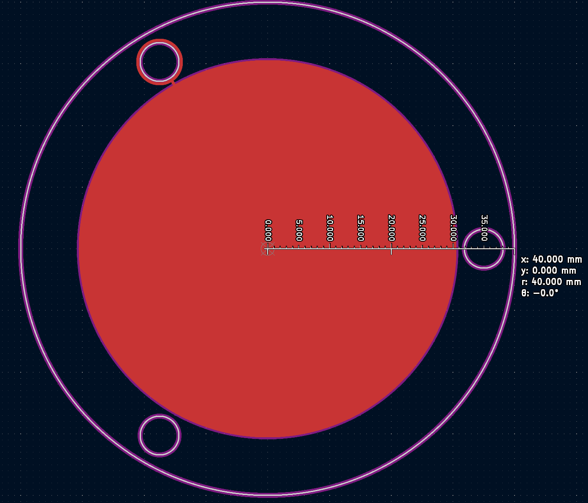

# ThGEM
Two iterations of ThGEM that are prototyped  
They were created with a custom component consistant of 2 parts.  
    

### ::: Dimensions of the Board ::: 
-Outer Ring (80 mm in Diamater)  
-Copper Circle (60 mm in Diamater)  
  
  
### ::: Distance between GEM-Holes :::
**Pitch**: 0.8 mm (Distance Between the Center of Holes)  
  
  
### ::: GEM-Hole Dimensions :::  
-Edge Cut (0.4 mm in Diameter)  
-No Fill Zone (0.42 mm in Diameter) #Only included in the Clearance Version  
  
  
**Hole Density Settings**  
-Pitch Distance = a (0.8 mm ::: For This Design)  
-Tile Distances are calculated with the image bellow  
   
  
### ::: Layers of the PCB :::  
**Three layers to the PCB Design**  
  
  
### ::: Gerber Plot Settings :::  
**The Settings of the Gerber files created in this repository**  

### ::: Required Programs :::  
KiCAD 7.0 or Greater (https://www.kicad.org/download/)  
  
